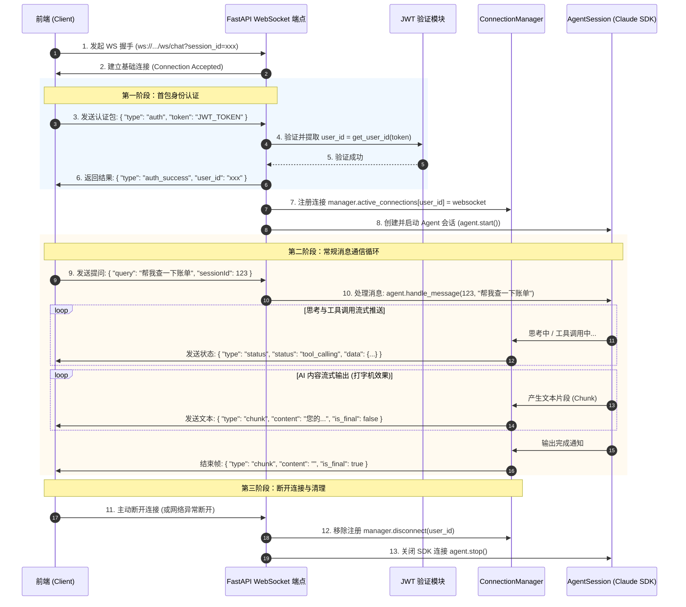

# Frontend-Backend WebSocket Connection Mechanism

本文档详细拆解了该项目（Community Agent API）前端与后端之间如何建立连接、如何进行身份认证、以及如何实现双向实时消息传输的完整流程。

---

## 1. 连接交互架构图
前端与后端的 WebSocket 通信全生命周期逻辑如下：



---

## 2. 详细步骤实现解析

### 第一阶段：握手与身份认证
在前端建立 TCP 连接后，必须在**第一帧**发送 JWT 进行认证，否则连接会被强制关闭。

* **WebSocket 监听端点**：`/ws/chat`，定义于 [dialog.py](file:///D:/Projects/code/python/communitys-agent-banked-py/app/api/dialog.py)。
* **认证实现逻辑**：
  ```python
  # app/api/dialog.py
  @router.websocket("/ws/chat")
  async def websocket_chat_endpoint(websocket: WebSocket, session_id: int | None = Query(None)):
      await websocket.accept()  # 接受底层连接
  
      try:
          # 1. 强制读取首条客户端消息（类型为 "auth"）
          raw = await websocket.receive_text()
          auth_msg = json.loads(raw)
          token = auth_msg.get("token", "")
  
          if not token:
              await websocket.send_json({"type": "error", "content": "缺少 token"})
              await websocket.close()
              return
  
          # 2. 验证 JWT 提取 user_id
          try:
              user_id = get_user_id(token)
          except Exception as e:
              await websocket.send_json({"type": "error", "content": f"Token 验证失败: {str(e)}"})
              await websocket.close()
              return
  
          # 3. 反馈认证成功
          await websocket.send_json({"type": "auth_success", "user_id": user_id})
  
          # 4. 进入聊天主循环
          await websocket_chat_handler(
              websocket, user_id=user_id, token=token, session_id=session_id, already_accepted=True
          )
  ```

---

### 第二阶段：连接管理器工作机制
一旦认证通过，连接将被移交给全局连接管理器进行统一调度。

* **定义位置**：[manager.py](file:///D:/Projects/code/python/communitys-agent-banked-py/app/websocket/manager.py)。
* **多连接维护**：使用 `active_connections: Dict[str, WebSocket]` 以 `user_id` 为键保存所有处于活跃状态的 WebSocket 实例。这样，后端的任何模块（包括 Agent 运行器、MCP 服务端等）只要有 `user_id`，就能将消息实时推送给对应的前端。
* **主要消息发送方法**：
  * `send_message(user_id, message)`：发送标准的 JSON 消息格式。如果捕捉到发送异常，会自动清理该连接。
  * `send_text_chunk(user_id, chunk, is_final)`：发送增量的 AI 文本切片，前端使用该消息渲染“打字机”流式字幕。
  * `send_status(user_id, status, data)`：推送 Agent 的运行状态。

---

### 第三阶段：消息循环与上下文凭证传递
在 `websocket_chat_handler` 中，系统使用一个 `while True` 的无尽循环监听前端请求：

```python
# app/websocket/routes.py
while True:
    raw = await websocket.receive_text()
    data = json.loads(raw)
    query_text = data.get("query", "")
    current_session_id = data.get("sessionId") or current_session_id

    # 核心细节：JWT Token 隐式向下流转
    set_request_token(token)

    # 调用 Agent 进行处理
    await agent.handle_message(current_session_id, query_text)
```

> [!IMPORTANT]
> **关于 `set_request_token(token)` 的妙用：**
> 每次循环时，用户的 `token` 都会被注册进一个基于线程/协程安全的 `ContextVars` (上下文变量) 中。
> **原因**：当大模型 Claude 决定调用某个 MCP 业务工具（例如“查询我的缴费单”或“修改预约”）时，该工具本质上需要向后端微服务发送 HTTP 请求。在这个微服务体系中，必须携带用户的 JWT 才能鉴权。通过把 Token 注入上下文变量中，底层 MCP 工具函数就能隐式获取该 Token 并放入 HTTP Header 中，实现了完美的“无需用户介入的链式鉴权”。

---

### 第四阶段：状态与内容的流式协议格式

在与前端建立连接后，系统以结构化的 JSON 包进行内容传输，前端只需监听这几种特定 `type` 的 JSON 格式即可：

#### 1) `type: "chunk"` (AI 文本流)
用于前端渲染 AI 正在说出的字词：
```json
{
  "type": "chunk",
  "content": "您",
  "is_final": false
}
```
* `content`: 单次产生的字片。
* `is_final`: 为 `true` 时，说明当前消息已经完全回答完毕，前端可以结束打字渲染状态。

#### 2) `type: "status"` (状态推送)
用于前端渲染精美的 Agent 思考态与工具调用步骤（如闪烁的呼吸灯、工具运行特效）：
* **正在思考**：
  ```json
  {
    "type": "status",
    "status": "thinking",
    "data": { "message": "正在思考..." }
  }
  ```
* **工具调用中**：
  ```json
  {
    "type": "status",
    "status": "tool_calling",
    "data": {
      "tool": "query_unpaid_bills",
      "display_name": "查询未缴费账单",
      "message": "正在查询您的社区未缴费用...",
      "icon": "bill-icon",
      "category": "finance"
    }
  }
  ```
* **工具执行完毕**：
  ```json
  {
    "type": "status",
    "status": "tool_completed",
    "data": {
      "tool": "query_unpaid_bills",
      "display_name": "查询未缴费账单",
      "message": "查询未缴费账单执行完成",
      "icon": "bill-icon",
      "category": "finance"
    }
  }
  ```
* **执行结束**：
  ```json
  {
    "type": "status",
    "status": "completed",
    "data": { "message": "回答完成" }
  }
  ```

## 3. WebSocket 关闭与清理生命周期的激活机制

WebSocket 连接的关闭与后端资源（如 `AgentSession`、数据库连接、底层微服务请求等）的清理和释放，是系统高可用性的重要保障。在项目中，**WebSocket 关闭与清理生命周期主要通过以下三种路径被激活**：

### 路径一：客户端主动关闭或网络异常中断（最常见）
* **触发场景**：用户直接关闭网页、刷新页面、或由于网络抖动（如切网、断网）导致 TCP 套接字发生物理断开。
* **底层激活链**：
  1. **异常抛出**：处于 [routes.py](file:///D:/Projects/code/python/communitys-agent-banked-py/app/websocket/routes.py) 消息循环底部的 `await websocket.receive_text()` 在感知到套接字关闭时，会瞬间抛出 `WebSocketDisconnect` 异常，强制中断 `while True` 的无尽循环。
  2. **移出活跃池**：异常被 `except WebSocketDisconnect:` 捕获，立即执行 `manager.disconnect(user_id)`，从全局 `ConnectionManager` 实例中删除对应 `user_id` 的套接字引用。
  3. **释放 SDK 会话**：随后程序执行 `finally:` 块。此时会自动运行 `await agent.stop()`。
  4. **底层清理**：`agent.stop()` 内部将断开与大模型（Claude SDK WebSocket）的所有连接并销毁客户端对象，防止出现僵尸进程。

```python
# app/websocket/routes.py 中的清理核心结构
try:
    while True:
        raw = await websocket.receive_text()
        # ... 业务处理
except WebSocketDisconnect:
    manager.disconnect(user_id)  # 1. 触发连接管理器移除
finally:
    await agent.stop()           # 2. 触发 Agent 销毁与资源释放
```

---

### 路径二：服务端业务运行期异常退场
* **触发场景**：在大模型回复或工具调用处理期间，发生未被内层 `try...except` 捕获的严重运行时错误（如数据库连接池耗尽、JSON 严重畸变等）。
* **底层激活链**：
  1. **捕获异常**：外层 `except Exception as e:` 将捕获这些非断开类的程序崩溃异常，输出 Traceback 调用栈日志以供排查。
  2. **发送错误通知**：在套接字仍存活的情况下，尝试调用 `await manager.send_error(user_id, f"处理出错: {str(e)}")` 告知前端。
  3. **强制移除与注销**：紧接着执行 `manager.disconnect(user_id)`，随后在 `finally:` 块中执行 `await agent.stop()`。
  4. **优雅下线**：最后，FastAPI 容器框架会隐式将此物理连接关闭，避免坏死连接继续存留于内存中。

---

### 路径三：握手首包认证失败的“即时拦截”关闭
* **触发场景**：前端虽然建立了 WebSocket 物理连接，但在首包验证阶段没有发送 Token，或者 Token 格式无效、失效。
* **底层激活链**：
  1. **认证拦截**：在 [dialog.py](file:///D:/Projects/code/python/communitys-agent-banked-py/app/api/dialog.py) 阶段，`token` 解密失败抛出异常。
  2. **即时报错并关闭**：服务器执行 `await websocket.send_json({"type": "error", "content": "..."})` 后，紧接着显式调用 **`await websocket.close()`**。
  3. **免初始化清理**：因为该物理连接在进入正式对话处理器 `websocket_chat_handler` 之前就已经被拦截关闭，所以系统**不会**去创建、启动 `AgentSession`，也无需做任何后期垃圾回收，极大节省了高并发下的系统握手开销。

---

## 4. 总结与最佳实践
1. **`finally` 块的坚固性**：无论是因为网路主动断开（`WebSocketDisconnect`），还是因为服务器逻辑崩溃（`Exception`），或者是一切正常的极少数良性断开，**`finally: await agent.stop()` 永远是最后执行的必经之路**。这确保了只要物理套接字销毁，内存中的 Agent 客户端实例、文件句柄和网络连接绝对能完全释放。
2. **状态完整回归**：当异常捕获并发送 `manager.send_error()` 后，前端监听到对应的 `error` 包即可优雅弹窗并重置发送按钮，避免前端页面永久处于假死或一直显示“正在思考”的窘境。
