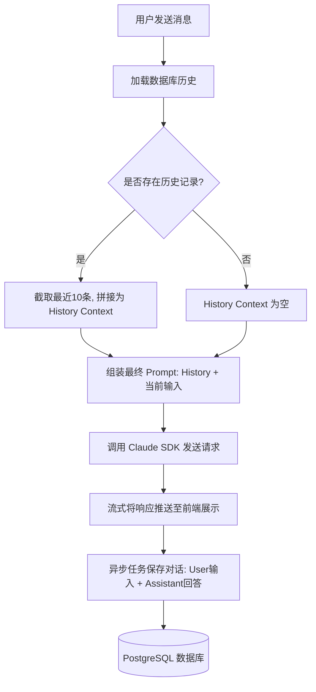

# Claude Agent 对话记忆（Memory）实现机制文档

本文档详细说明了当前项目（Community Agent API）中对话记忆（Memory）的完整实现机制、核心代码调用路径及工作流程。

---

## 1. 核心设计概述
本项目的对话记忆采用了 **“数据库持久化存储 + 历史上下文 Prompt 拼接（Prompt Prepending）”** 的设计模式。这种架构保证了：
* **跨会话持久性**：对话记录存储在 PostgreSQL 数据库中，即使服务重启或 WebSocket 连接断开，历史记忆也不会丢失。
* **无状态大模型调用**：底层大模型（Claude/DeepSeek）本身无需维护持久会话状态，每次请求都是一个包含历史背景的独立 Prompt。
* **Token 与成本控制**：每次交互仅加载时间顺序上 **最近的 10 条消息**（约 5 轮对话）作为上下文，既保证了近期的记忆力，又避免了 Token 溢出和高昂的费用。
* **异步响应优化**：保存聊天记录的操作是异步进行的，完全不阻塞大模型的流式文本返回。

---

## 2. 核心工作流程
当用户通过 WebSocket 发送一条新消息时，后端处理流程如下：



---

## 3. 核心源码分析

### 3.1 记忆的加载与 Prompt 拼接
核心逻辑位于 [runner.py](file:///D:/Projects/code/python/communitys-agent-banked-py/app/agent/runner.py)。

#### 1) 历史上下文检索与拼接
`_build_history_context` 会从数据库获取该 `session_id` 的所有消息，截取最后 10 条并格式化为纯文本：

```python
# app/agent/runner.py
def _build_history_context(session_id: int) -> str:
    """从数据库加载最近 10 条消息，构建历史上下文字符串"""
    try:
        res = get_messages(session_id)
        if not res.data:
            return ""
        lines = []
        # 获取最后 10 条消息（最新的在后）
        for msg in res.data[-10:]:
            role = "用户" if msg["role"] == "user" else "助手"
            lines.append(f"{role}: {msg['content']}")
        # 拼接为带格式的 Prompt 注入前缀
        return "以下是之前的对话记录：\n" + "\n".join(lines) + "\n\n"
    except Exception as e:
        print(f"[Runner] 加载历史消息失败: {e}")
        return ""
```

#### 2) 用户消息处理与调用
`handle_message` 方法将拼接好的历史记录作为前缀拼入 `prompt` 中，并使用 `ClaudeSDKClient` 发送：

```python
# app/agent/runner.py
async def handle_message(self, session_id: int, user_input: str):
    # 1. 组装历史上下文
    history_ctx = _build_history_context(session_id)
    prompt = f"{history_ctx}用户: {user_input}" if history_ctx else user_input

    # 2. 发送请求给 Claude SDK
    await self._client.query(prompt)
    
    # 3. 接收流式响应并推送到前端 (省略流式输出及工具调用部分代码) ...

    # 4. 对话结束时，启动后台异步任务保存本次的对话记录
    if session_id and full_response:
        asyncio.create_task(_save(session_id, user_input, full_response))
```

---

### 3.2 记忆的保存（持久化）

#### 1) 异步保存入口
```python
# app/agent/runner.py
async def _save(session_id: int, user_input: str, response: str):
    try:
        save_message(session_id=session_id, role="user", content=user_input)
        save_message(session_id=session_id, role="assistant", content=response)
    except Exception as e:
        print(f"[Runner] 保存消息失败: {e}")
```

#### 2) 数据库持久化操作
核心逻辑位于 [message.py](file:///D:/Projects/code/python/communitys-agent-banked-py/app/database/service/message.py)。这里通过 SQLAlchemy 操作数据库：

```python
# app/database/service/message.py
from app.database.client import SessionLocal, MessageModel, DbResult

# 插入一条新消息
def save_message(session_id: int, role: str, content: str):
    db = SessionLocal()
    try:
        new_message = MessageModel(session_id=session_id, role=role, content=content)
        db.add(new_message)
        db.commit()
        db.refresh(new_message)
        return DbResult(data=[{
            "id": new_message.id,
            "session_id": new_message.session_id,
            "role": new_message.role,
            "content": new_message.content,
            "created_at": new_message.created_at.isoformat() if new_message.created_at else None
        }])
    except Exception as e:
        db.rollback()
        raise e
    finally:
        db.close()

# 获取历史聊天记录
def get_messages(session_id: int):
    db = SessionLocal()
    try:
        messages = (
            db.query(MessageModel)
            .filter(MessageModel.session_id == session_id)
            .order_by(MessageModel.created_at.asc())
            .all()
        )
        data = [{
            "id": m.id,
            "session_id": m.session_id,
            "role": m.role,
            "content": m.content,
            "created_at": m.created_at.isoformat() if m.created_at else None
        } for m in messages]
        return DbResult(data=data)
    finally:
        db.close()
```

---

## 4. 优化建议与改进方向
虽然当前的实现机制轻量高效，但在未来高并发或复杂场景下，可以考虑以下优化方案：
1. **滑动窗口动态裁剪 (Sliding Window)**：目前是硬性截取 10 条。可以使用 Token 计算库（如 `tiktoken`）动态统计历史 Token 数，保证把尽可能多、但又不超过设定阈值（如 2000 tokens）的历史记录放入上下文。
2. **向量数据库记忆（Retrieval-Augmented Generation, RAG）**：若需实现超长跨度的对话记忆，可以在用户输入时，提取关键词从向量数据库检索最相关的“往期记忆”，作为长短期记忆补充，而非只带入最近的 10 条。
3. **缓存层引入 (Redis)**：对于高频对话，历史记录可以先缓存在 Redis 中，周期性批量同步回 PostgreSQL 数据库，以减少高频操作 PostgreSQL 的数据库连接池压力。
