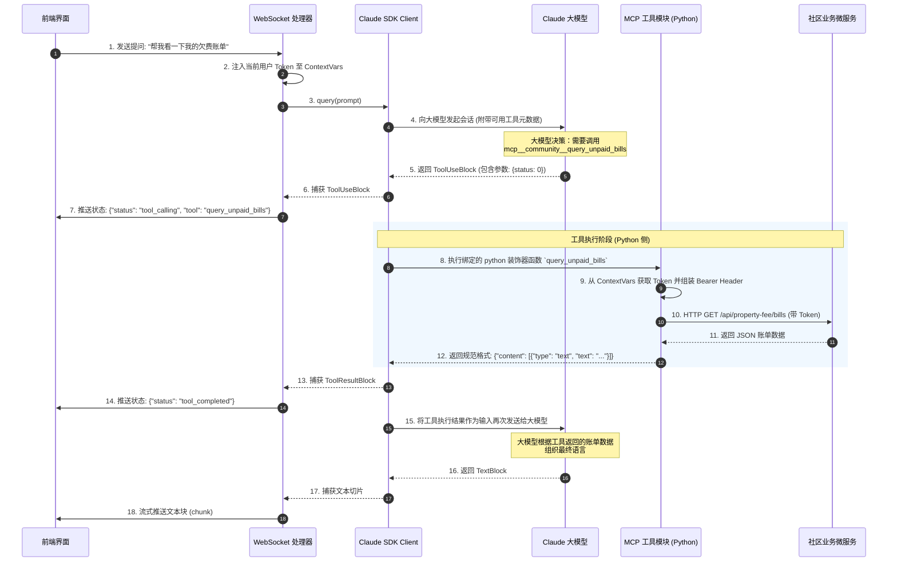

# Claude Agent Tool Call (工具调用) 实现机制文档

本文档详细说明了当前项目（Community Agent API）中基于 **Model Context Protocol (MCP)** 协议的工具调用（Tool Call）实现逻辑，分析了从模型决策到工具执行再到前端渲染的完整链路。

---

## 1. 整体流程时序图

以下是用户提问“帮我查一下欠费账单”时，工具调用的完整闭环流程：



---

## 2. 核心步骤与实现机制

### 2.1 工具定义与注册 (MCP)
在 [server.py](file:///D:/Projects/code/python/communitys-agent-banked-py/app/tools_mcp/server.py) 中，所有与社区业务相关的工具都被声明为 **Model Context Protocol (MCP)** 服务。

#### 1) 使用 `@tool` 装饰器声明
工具定义使用 `claude_agent_sdk` 提供的 `@tool` 装饰器，指明工具的名称、作用描述以及参数约束：
```python
# app/tools_mcp/server.py
@tool("query_unpaid_bills", "查询用户所有代缴物业费账单", {"status": int})
async def query_unpaid_bills(args: dict) -> dict:
    try:
        # 通过统一的 HTTP 工具函数发起微服务请求，参数从 args 字典中提取
        data = await _get("/api/property-fee/bills", {"status": args.get("status", 0)})
        return _ok(data)  # 返回规范格式数据
    except Exception as e:
        return _err(f"账单查询失败: {e}")
```

#### 2) 创建 MCP 服务器并挂载工具
所有定义好的工具都会被统一编组到一个名为 `community` 的 MCP 服务中：
```python
# app/tools_mcp/server.py
community_server = create_sdk_mcp_server(
    name="community",
    tools=[
        get_time,
        get_weather,
        query_unpaid_bills,
        # ... 其他工具
    ],
)
```

---

### 2.2 工具与 Agent 的绑定
在 [runner.py](file:///D:/Projects/code/python/communitys-agent-banked-py/app/agent/runner.py) 初始化 `AgentSession` 时，会将上述的 MCP 服务器以参数形式挂载并启动：

```python
# app/agent/runner.py
async def start(self):
    options = ClaudeAgentOptions(
        model=CLAUDE_MODEL,
        mcp_servers={"community": community_server}, # 挂载自定义的 MCP 服务
        allowed_tools=_MCP_TOOLS,                    # 允许调用的全限定工具列表
        permission_mode="bypassPermissions",        # 免授权模式（后台直接执行）
    )
    self._client = ClaudeSDKClient(options=options)
    await self._client.connect()
```

---

### 2.3 工具调用中的鉴权自动穿透
在工具实际执行微服务调用时，必须要带有当前操作用户的身份 Token。由于工具运行在后台的 MCP 协程中，为了不让 Token 的传递污染工具函数的参数定义，项目使用了 `ContextVars` 进行**自动穿透**：

1. **设置 Token**：每次 WebSocket 收到消息时，将当前用户的 Token 注入当前上下文：
   ```python
   # app/websocket/routes.py 中的 websocket_chat_handler
   set_request_token(token)
   ```
2. **提取并使用 Token**：在 [server.py](file:///D:/Projects/code/python/communitys-agent-banked-py/app/tools_mcp/server.py) 的底层网络工具中，发起请求时会自动读取并组装为 HTTP 头的 `Authorization: Bearer <token>`：
   ```python
   # app/tools_mcp/server.py
   def _auth_headers() -> dict:
       token = get_request_token()  # 从 ContextVars 隐式获取
       return {"Authorization": f"Bearer {token}"} if token else {}
   ```

---

### 2.4 流式状态推送与前端渲染
在工具调用的整个周期中，用户常常需要等待（比如生成图片、查询第三方 API 等）。为了提供友好的用户体验，后端在流式输出中会持续监测是否有“工具调用”事件发生，并实时向前端发送 `status` 指令。

在 `app/agent/runner.py` 的主消息接收器中：
```python
# app/agent/runner.py 中的 handle_message 方法
async for msg in self._client.receive_response():
    if isinstance(msg, AssistantMessage):
        for block in msg.content:
            # A. 检测到大模型决定开始调用工具
            if isinstance(block, ToolUseBlock):
                short_name = _strip_mcp_prefix(block.name)
                info = get_tool_display_info(short_name)  # 获取该工具的精美图标和文案
                await manager.send_status(self.user_id, "tool_calling", {
                    "tool": short_name,
                    "display_name": info["display_name"],
                    "message": info["description"],
                    "icon": info["icon"],
                    "category": info["category"],
                })

            # B. 检测到 Python 侧工具运行完成并返回了结果
            elif isinstance(block, ToolResultBlock):
                if last_tool_name:
                    short_name = _strip_mcp_prefix(last_tool_name)
                    info = get_tool_display_info(short_name)
                    await manager.send_status(self.user_id, "tool_completed", {
                        "tool": short_name,
                        "display_name": info["display_name"],
                        "message": f"{info['display_name']}执行完成",
                        ...
                    })
```

---

## 3. 设计亮点与总结
1. **标准化协议 (MCP)**：使用标准的 Model Context Protocol 对工具进行管理，实现了工具的松耦合。以后如果需要添加新工具，只需在 `server.py` 里添加一个被 `@tool` 修饰的函数，然后将其注册进 `community_server` 即可，完全不需要改动核心 Agent 调度逻辑。
2. **鉴权无缝穿透**：借助 Python 协程级别的全局上下文变量 `ContextVars`，优雅地解决了多租户模式下后台工具调用时所需 JWT Token 的安全隐性传递。
3. **极佳的可读性和交互感**：通过工具元数据（`get_tool_display_info`）把原本生硬的工具名（如 `query_unpaid_bills`）翻译成有温度的“账单查询”和对应的图标，配合 WebSocket 的 `tool_calling` 与 `tool_completed` 阶段流式通知前端，实现了极度流畅和生动的卡片加载微动画效果。
