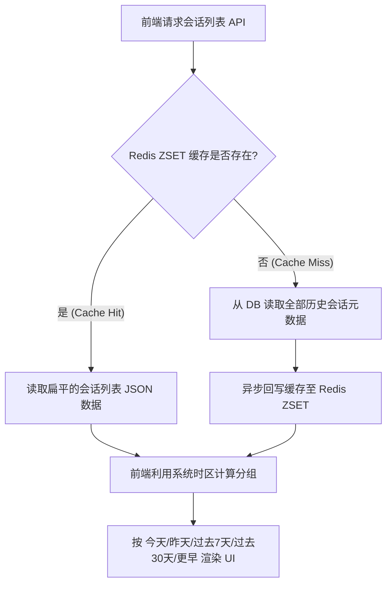

# 工业级会话查询重构方案：时区安全的前端分组与后端缓存加速

本项目目前采用传统的 `OFFSET` / `LIMIT` 分页查询会话列表，这在工业级场景下面临两个痛点：
1. **时区一致性与体验限制**：传统的后端分页无法自适应多时区用户的本地时间划分；在服务端对自然日（今天、昨天、过去7天等）进行分组，会导致跨国用户的自然日边界与本地系统时间产生严重偏差。
2. **深度分页性能瓶颈**：随着用户历史会话的不断累积，传统 `OFFSET` 分页查询性能呈线性下降，且每次请求都需穿透至数据库执行 `COUNT` 与 `SELECT`。

本方案针对这些痛点进行重构设计，核心原则是：**后端负责扁平数据的高性能缓存（基于 Redis ZSET）与数据库检索；前端负责时区安全的时间分组计算。**

---

## 1. 架构设计图



### 1.1 核心设计优势
* **时区安全**：后端数据以带有标准 UTC 时区标识（如 `Z` 或 `+00:00`）的 ISO 8601 字符串返回。前端利用浏览器原生系统时区将时间戳转换并归类，彻底解决跨国用户的时区边界问题。
* **高响应性与低延迟**：通过缓存单个用户的所有扁平会话列表（元数据量通常小于 200 条，内存消耗极小），读取操作只需 $O(\log N)$ 的时间复杂度，直接避免了每次翻页请求穿透至数据库。

---

## 2. 数据库与索引优化

在 PostgreSQL 中，建立复合索引以支持覆盖索引扫描（Index-Only Scan），避免因回表排序（Filesort）导致的大表查询延迟。

### 2.1 物理索引创建
必须在 [SessionModel](file:///D:/Projects/code/python/communitys-agent-banked-py/app/models/session.py) 所在的数据库表上建立复合索引：
```sql
CREATE INDEX idx_sessions_user_created ON sessions (user_id, created_at DESC);
```
* **原理**：该复合索引能让数据库直接根据 `user_id` 过滤，并按照 `created_at` 降序从索引中直接读取所需字段，无需进行额外的内存或磁盘排序。

---

## 3. Redis 缓存方案设计 (ZSET 架构)

我们采用 **Redis Sorted Set (ZSET)** 来缓存扁平的历史会话列表，实现微秒级的高频读取。

### 3.1 缓存数据结构
* **Key 设计**：`user:sessions:{user_id}`
* **数据结构**：`Sorted Set (ZSET)`
  * **Score**：`created_at` 的 Unix 时间戳（float 类型，保障按时间降序极速检索）。
  * **Member**：会话的 JSON 序列化字符串，例如：
    ```json
    {"id": 32, "title": "物业缴费咨询", "created_at": "2026-06-16T04:00:00Z"}
    ```

### 3.2 缓存更新策略 (Write-Through + Cache-Aside)

1. **读取列表 (Read Path)**:
   * 尝试通过 `ZREVRANGEBYSCORE user:sessions:{user_id} +inf -inf` 获取该用户的所有会话缓存。
   * 如果缓存存在（Cache Hit），直接返回扁平数据。
   * 如果缓存不存在（Cache Miss），回源数据库加载，写入 Redis ZSET，并设置过期时间（如 1 天）。
2. **创建会话 (Create Path)**:
   * 写入数据库成功后，同步将新生成的会话通过 `ZADD` 写入对应的 ZSET 中。
3. **重命名或删除 (Update / Delete Path)**:
   * 在 [update_session_title](file:///D:/Projects/code/python/communitys-agent-banked-py/app/database/service/session.py#L59)、[rename_session_service](file:///D:/Projects/code/python/communitys-agent-banked-py/app/database/service/session.py#L112) 或 [delete_session_service](file:///D:/Projects/code/python/communitys-agent-banked-py/app/database/service/session.py#L95) 中，操作数据库成功后，直接对对应的 Redis Key 执行 `DEL`，利用下一次 Read Path 的 Cache Miss 自动拉取最新的数据库记录重建缓存，以保证缓存的强一致性并规避脏写。

---

## 4. 后端服务代码框架 (Python)

在 [session.py](file:///D:/Projects/code/python/communitys-agent-banked-py/app/database/service/session.py) 中，将原有的 [get_sessions_paginated](file:///D:/Projects/code/python/communitys-agent-banked-py/app/database/service/session.py#L6) 弃用，替换为以下不分页的扁平列表缓存方法：

```python
import json
import asyncio
from datetime import datetime
from app.services.memory import RedisMemoryManager
from app.core.database import SessionLocal
from app.models.session import SessionModel

CACHE_EXPIRE_SECONDS = 86400

async def get_flat_sessions(user_id: str) -> list:
    """
    极速获取用户的扁平会话列表（引入 ZSET 缓存）
    """
    cache_key = f"user:sessions:{user_id}"
    
    # 1. 尝试从 Redis 读取 ZSET 缓存
    try:
        cached_data = await RedisMemoryManager.zrevrange(cache_key, 0, -1)
        if cached_data:
            return [json.loads(item) for item in cached_data]
    except Exception as e:
        logger.error(f"Redis 读取失败: {e}")
        
    # 2. 缓存未命中 (Cache Miss)，回源数据库查询
    db = SessionLocal()
    try:
        sessions_db = (
            db.query(SessionModel)
            .filter(SessionModel.user_id == str(user_id))
            .order_by(SessionModel.created_at.desc())
            .all()
        )
        
        sessions = [{
            "id": s.id,
            "user_id": s.user_id,
            "title": s.title,
            "created_at": s.created_at.isoformat() + "Z" if s.created_at else None # 显式标记 UTC 时区
        } for s in sessions_db]
        
        # 3. 异步回写缓存到 Redis
        if sessions:
            asyncio.create_task(_write_sessions_to_cache(cache_key, sessions))
            
        return sessions
    finally:
        db.close()

async def _write_sessions_to_cache(cache_key: str, sessions: list):
    try:
        pipe = RedisMemoryManager.pipeline()
        pipe.delete(cache_key)
        for s in sessions:
            # 使用时间戳作为分值确保 ZSET 顺序
            dt = datetime.fromisoformat(s["created_at"].replace("Z", "+00:00"))
            score = dt.timestamp() if s["created_at"] else 0
            pipe.zadd(cache_key, {json.dumps(s): score})
        pipe.expire(cache_key, CACHE_EXPIRE_SECONDS)
        await pipe.execute()
    except Exception as e:
        logger.error(f"回写 Redis 缓存失败: {e}")
```

---

## 5. 前端分组算法实现 (TypeScript)

前端在拉取接口数据后，在本地计算出用户时区下的自然日边界，实现高精度的分组渲染。

```typescript
export interface Session {
  id: number;
  user_id: string;
  title: string;
  created_at: string;
}

export interface GroupedSessions {
  today: Session[];
  yesterday: Session[];
  last7Days: Session[];
  last30Days: Session[];
  earlier: Session[];
}

/**
 * 将平铺的会话列表根据用户本地系统的时区和当前时间进行分组归类
 */
export function groupSessionsByLocalDate(sessions: Session[]): GroupedSessions {
  const grouped: GroupedSessions = {
    today: [],
    yesterday: [],
    last7Days: [],
    last30Days: [],
    earlier: []
  };

  const now = new Date();
  const todayStart = new Date(now.getFullYear(), now.getMonth(), now.getDate());
  const ONE_DAY_MS = 24 * 60 * 60 * 1000;
  
  const yesterdayStart = new Date(todayStart.getTime() - ONE_DAY_MS);
  const sevenDaysAgoStart = new Date(todayStart.getTime() - 7 * ONE_DAY_MS);
  const thirtyDaysAgoStart = new Date(todayStart.getTime() - 30 * ONE_DAY_MS);

  const todayStartTime = todayStart.getTime();
  const yesterdayStartTime = yesterdayStart.getTime();
  const sevenDaysAgoStartTime = sevenDaysAgoStart.getTime();
  const thirtyDaysAgoStartTime = thirtyDaysAgoStart.getTime();

  for (const session of sessions) {
    if (!session.created_at) {
      grouped.earlier.push(session);
      continue;
    }

    // 浏览器会自动将服务端传回的 UTC ISO 时间转为本机时区的 Date 对象
    const createdDate = new Date(session.created_at);
    const createdTime = createdDate.getTime();

    if (isNaN(createdTime)) {
      grouped.earlier.push(session);
      continue;
    }

    if (createdTime >= todayStartTime) {
      grouped.today.push(session);
    } else if (createdTime >= yesterdayStartTime) {
      grouped.yesterday.push(session);
    } else if (createdTime >= sevenDaysAgoStartTime) {
      grouped.last7Days.push(session);
    } else if (createdTime >= thirtyDaysAgoStartTime) {
      grouped.last30Days.push(session);
    } else {
      grouped.earlier.push(session);
    }
  }

  return grouped;
}
```
