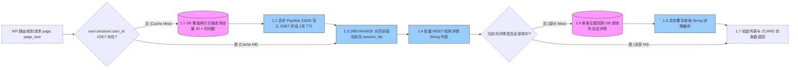
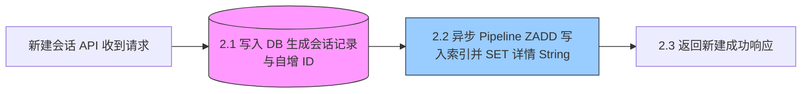
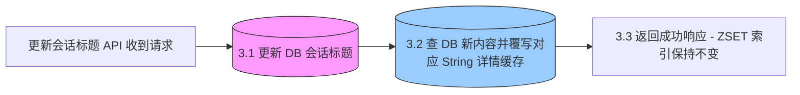
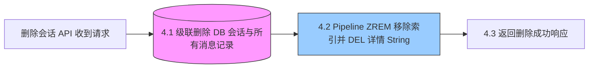

# 工业级会话查询重构方案：基于 ZSET 与 String 索引数据分离的懒加载分页缓存架构

本项目目前采用传统的 `OFFSET` / `LIMIT` 分页查询会话历史，在面临海量历史会话时，存在深度分页数据库性能下降以及缺乏缓存加速的隐患。

之前曾考虑过将“全量会话数据序列化为 JSON 塞入单个用户的 ZSET 缓存”的方案，但这在工业级场景下有重大缺陷：
1. **BigKey 隐患**：若用户历史会话数量较多，直接在单个 ZSET 的 Member 中存入完整 JSON 详情，会导致该 ZSET 的体积迅速膨胀，成为 Redis 经典 BigKey 隐患，甚至在并发增删、更新时导致 Redis 线程阻塞。
2. **全量拉取网卡过载**：全量拉取用户的所有会话数据返回给前端，在用户会话数据上千条时，网卡吞吐量与网络传输延迟将成为严重瓶颈。
3. **缓存命中率低下与整体击穿**：每当用户重命名标题（Rename）或删除（Delete）单个会话时，都需要将整个 ZSET 彻底删除（DEL），导致缓存高频失效整体击穿，穿透至数据库。

为了彻底解决以上问题，本项目设计了**方案 A（索引与详情分离缓存架构）**，将 ZSET 仅用作轻量级的 ID 排序索引，具体对象内容存储在 String 结构中，并使用 MGET 批量按需分页懒加载。

---

## 1. 架构设计图 (Index-Data Split)

为防止 VS Code Markdown 预览时由于图片纵向过长导致排版被压缩变形，以下将 4 个业务核心数据流拆分为独立的横向（Left-to-Right）流程图展示：

### 1.1 分页获取会话列表 (Read Flow)


### 1.2 新建会话 (Create Flow)


### 1.3 修改会话标题 (Update Flow)


### 1.4 删除会话 (Delete Flow)


---

## 2. 数据库与索引优化

为配合 ZSET 索引的高效回源构建，在 PostgreSQL 数据库中需对 `sessions` 表建立包含附加列的覆盖索引（Index-Only Scan），避免由于回表导致的回源排序（Filesort）延迟。

### 2.1 物理索引创建 (PostgreSQL 11+ 最佳实践)
推荐在会话表上创建包含附加列的覆盖索引：
```sql
CREATE INDEX idx_sessions_user_created_cover ON sessions (user_id, created_at DESC) INCLUDE (id);
```
* **Index-Only Scan (零回表)**：构建 ZSET 索引时，回源查询仅需 `id` 和 `created_at` 字段。通过 `INCLUDE (id)`，PostgreSQL 只需要从缓存的索引页中直接获取这些信息并构建 ZSET，实现快速回源构建。

---

## 3. Redis 缓存数据结构设计

### 3.1 会话有序索引 (ZSET)
* **Key**：`user:sessions:{user_id}`
* **Score**：`created_at` 的 Unix 时间戳（`float` 类型，用于按时间降序极速分页检索）
* **Member**：`session_id`（如 `"32"`）
* **TTL**：1 天（86400 秒）

### 3.2 会话详情缓存 (String)
* **Key**：`session:detail:{session_id}`
* **Value**：JSON 序列化的会话详情字符串，例如：
  ```json
  {"id": 32, "user_id": "9527", "title": "物业费缴费咨询", "created_at": "2026-06-16T04:00:00Z"}
  ```
* **TTL**：7 天（604800 秒）

---

## 4. 后端修改指南及真实要写的代码

为了落地该方案，后端需要修改两个文件：
1. **仓储层** [app/database/repository/session.py](file:///D:/Projects/code/python/communitys-agent-banked-py/app/database/repository/session.py) ：废弃原有的 `get_sessions_paginated` 方法，新增两个用于细粒度回源和覆盖索引查询的函数。
2. **服务层** [app/services/session.py](file:///D:/Projects/code/python/communitys-agent-banked-py/app/services/session.py) ：引入 `redis_client`，完全重写 `get_sessions_paginated`、`create_session`、`rename_session_service` 以及 `delete_session_service`，将缓存编排逻辑深度集成。

### 4.1 仓储层修改：[app/database/repository/session.py](file:///D:/Projects/code/python/communitys-agent-banked-py/app/database/repository/session.py)

#### 哪里改成什么：
*   **废弃/保留原有的** `get_sessions_paginated`，改在服务层统一接管分页和缓存决策。
*   **新增** `get_session_by_id` 方法，支持单个详情回源。
*   **新增** `get_user_session_ids_and_created_at` 方法，只查询 ID 和时间，实现覆盖索引扫描，用于高效重建缓存索引。

#### 真实要写的代码：
```python
def get_session_by_id(session_id: int):
    """
    根据会话 ID 精准查询会话元数据（详情回源时使用）
    """
    db = SessionLocal()
    try:
        session = db.query(SessionModel).filter(SessionModel.id == session_id).first()
        if session:
            return {
                "id": session.id,
                "user_id": session.user_id,
                "title": session.title,
                "created_at": session.created_at.isoformat() if session.created_at else None
            }
        return None
    finally:
        db.close()


def get_user_session_ids_and_created_at(user_id: str):
    """
    仅拉取用户的会话 ID 和创建时间（构建 ZSET 缓存时使用，覆盖索引扫描）
    """
    db = SessionLocal()
    try:
        sessions = (
            db.query(SessionModel.id, SessionModel.created_at)
            .filter(SessionModel.user_id == str(user_id))
            .all()
        )
        return [{"id": s.id, "created_at": s.created_at} for s in sessions]
    finally:
        db.close()
```

---

### 4.2 服务层修改：[app/services/session.py](file:///D:/Projects/code/python/communitys-agent-banked-py/app/services/session.py)

#### 哪里改成什么：
*   **头部引入** 异步 Redis 全局客户端 `from app.core.redis import redis_client`。
*   **完全重写** [get_sessions_paginated](file:///D:/Projects/code/python/communitys-agent-banked-py/app/services/session.py#L14)，实现 `ZREVRANGE` 分页结合 `MGET` 的二级懒加载查询逻辑。
*   **完全重写** [create_session](file:///D:/Projects/code/python/communitys-agent-banked-py/app/services/session.py#L21)，写入数据库后，同步将 ID 添加入 ZSET 缓存，并将详情写入 String 缓存。
*   **完全重写** [rename_session_service](file:///D:/Projects/code/python/communitys-agent-banked-py/app/services/session.py#L42)，标题修改后仅修改对应的 String 详情缓存，保持 ZSET 命中率 100%。
*   **完全重写** [delete_session_service](file:///D:/Projects/code/python/communitys-agent-banked-py/app/services/session.py#L35)，添加传入 `user_id`，并使用 Pipeline 同步移除 ZSET 项和删除对应的 String 键值。

#### 真实要写的代码：
```python
import json
import asyncio
from datetime import datetime
from loguru import logger
from app.core.redis import redis_client
from app.database.repository.session import (
    create_session as db_create_session,
    delete_session_service as db_delete_session_service,
    rename_session_service as db_rename_session_service,
    check_session_owner as db_check_session_owner,
    update_session_title as db_update_session_title,
    get_session_by_id as db_get_session_by_id,
    get_user_session_ids_and_created_at as db_get_user_session_ids_and_created_at,
    get_sessions_paginated as db_get_sessions_paginated, # 异常时降级备用
)

INDEX_CACHE_EXPIRE = 86400       # ZSET 索引缓存 1天 (秒)
DETAIL_CACHE_EXPIRE = 604800     # 详情缓存 7天 (秒)


async def get_sessions_paginated(user_id: str, page: int = 1, page_size: int = 10) -> dict:
    """
    分页懒加载获取会话历史列表 (ZSET + MGET 索引数据分离架构)
    由于 redis_client 已配置 decode_responses=True，返回值均为 string 类型
    """
    zset_key = f"user:sessions:{user_id}"
    start = (page - 1) * page_size
    stop = start + page_size - 1
    
    # 1. 检查 ZSET 索引缓存是否存在，若不存在则回源构建
    try:
        exists = await redis_client.exists(zset_key)
        if not exists:
            await _rebuild_user_session_index(user_id, zset_key)
    except Exception as e:
        logger.error(f"Redis 检查索引失败，降级回源 DB: {e}")
        return db_get_sessions_paginated(user_id, page, page_size)

    # 2. 从 ZSET 分页获取当前页的 session_id 列表，并获取总数 (ZCARD)
    try:
        async with redis_client.pipeline(transaction=True) as pipe:
            pipe.zrevrange(zset_key, start, stop)
            pipe.zcard(zset_key)
            session_ids, total_count = await pipe.execute()
    except Exception as e:
        logger.error(f"Redis 分页查询索引失败: {e}")
        return db_get_sessions_paginated(user_id, page, page_size)

    # ZSET 中可能存在空索引防击穿占位符
    if "placeholder" in session_ids:
        session_ids = [sid for sid in session_ids if sid != "placeholder"]
        total_count = max(0, total_count - 1)

    if not session_ids:
        return {"items": [], "total": 0, "page": page, "page_size": page_size}

    # 3. 批量 MGET 获取这组 session_id 的详情缓存
    detail_keys = [f"session:detail:{sid}" for sid in session_ids]
    try:
        cached_details = await redis_client.mget(detail_keys)
    except Exception as e:
        logger.error(f"Redis 批量获取会话详情失败: {e}")
        cached_details = [None] * len(session_ids)

    # 4. 遍历详情结果，对缺失缓存的 session_id 进行单条回源并回写
    items = []
    for i, sid in enumerate(session_ids):
        detail_json = cached_details[i]
        
        if detail_json:
            try:
                items.append(json.loads(detail_json))
            except Exception as parse_err:
                logger.error(f"解析会话详情缓存失败: {parse_err}")
                detail_json = None
                
        if not detail_json:
            # 缓存未命中，精准回源 DB 并回写缓存
            session_data = db_get_session_by_id(int(sid))
            if session_data:
                items.append(session_data)
                # 异步单条回写 String 详情缓存
                asyncio.create_task(
                    redis_client.set(
                        f"session:detail:{sid}", 
                        json.dumps(session_data), 
                        ex=DETAIL_CACHE_EXPIRE
                    )
                )

    return {
        "items": items,
        "total": total_count
    }


async def _rebuild_user_session_index(user_id: str, zset_key: str):
    """
    回源 DB 加载该用户所有的会话 ID 与时间戳，并重建 ZSET 索引缓存
    """
    try:
        sessions_db = db_get_user_session_ids_and_created_at(user_id)
        
        if not sessions_db:
            # 写入空缓存占位符以防止缓存穿透，设置较短的过期时间 (60秒)
            async with redis_client.pipeline(transaction=True) as pipe:
                pipe.delete(zset_key)
                pipe.zadd(zset_key, {"placeholder": 0})
                pipe.expire(zset_key, 60)
                await pipe.execute()
            return

        async with redis_client.pipeline(transaction=True) as pipe:
            pipe.delete(zset_key)
            for s in sessions_db:
                # 优先获取 created_at，缺省使用当前时间戳保证排序
                created_at = s["created_at"]
                score = created_at.timestamp() if isinstance(created_at, datetime) else 0
                pipe.zadd(zset_key, {str(s["id"]): score})
            pipe.expire(zset_key, INDEX_CACHE_EXPIRE)
            await pipe.execute()
    except Exception as e:
        logger.error(f"重建用户 ZSET 会话索引缓存失败: {e}")


def create_session(user_id: int, title: str) -> dict:
    """
    同步创建会话记录，并异步将其 ID 添加入 ZSET 缓存，同时直接写入 String 详情缓存
    """
    session_res = db_create_session(user_id, title)
    if not session_res:
        return {}
        
    session_id = session_res["id"]
    created_at_str = session_res["created_at"]
    
    # 转换为用于 ZSET 排序的 score
    try:
        # 兼容带 'Z' 的 UTC 字符串时间转换
        dt_str = created_at_str.replace("Z", "+00:00") if created_at_str else None
        score = datetime.fromisoformat(dt_str).timestamp() if dt_str else datetime.utcnow().timestamp()
    except Exception:
        score = datetime.utcnow().timestamp()

    zset_key = f"user:sessions:{user_id}"
    detail_data = {
        "id": session_id,
        "user_id": str(user_id),
        "title": title,
        "created_at": created_at_str
    }
    
    # 异步同步写入 Redis 索引与详情
    async def _write_cache():
        try:
            async with redis_client.pipeline(transaction=True) as pipe:
                # 1. 写入 ZSET 索引
                pipe.zadd(zset_key, {str(session_id): score})
                # 2. 写入 String 详情
                pipe.set(f"session:detail:{session_id}", json.dumps(detail_data), ex=DETAIL_CACHE_EXPIRE)
                await pipe.execute()
        except Exception as err:
            logger.error(f"创建会话同步写入缓存失败: {err}")
            
    asyncio.create_task(_write_cache())
    return session_res


def check_session_owner(session_id: int, user_id: str) -> bool:
    """
    检查会话归属权
    """
    return db_check_session_owner(session_id, user_id)


def delete_session_service(session_id: int, user_id: str) -> bool:
    """
    删除会话，同步级联删除数据库，并清理 Redis 索引与详情
    """
    db_success = db_delete_session_service(session_id)
    if not db_success:
        return False
        
    # 同步异步清理 Redis
    zset_key = f"user:sessions:{user_id}"
    detail_key = f"session:detail:{session_id}"
    
    async def _clean_cache():
        try:
            async with redis_client.pipeline(transaction=True) as pipe:
                pipe.zrem(zset_key, str(session_id))
                pipe.delete(detail_key)
                await pipe.execute()
        except Exception as err:
            logger.error(f"删除会话时清理缓存失败: {err}")
            
    asyncio.create_task(_clean_cache())
    return True


def rename_session_service(session_id: int, new_title: str) -> bool:
    """
    重命名会话，同步写 DB，并精确单条覆盖写入 String 详情缓存，保持 ZSET 命中率 100%
    """
    db_success = db_rename_session_service(session_id, new_title)
    if not db_success:
        return False
        
    # 单条覆盖覆写 String 详情缓存，杜绝大 Key 频繁重建
    detail_key = f"session:detail:{session_id}"
    
    async def _update_cache():
        session_data = db_get_session_by_id(session_id)
        if session_data:
            try:
                await redis_client.set(detail_key, json.dumps(session_data), ex=DETAIL_CACHE_EXPIRE)
            except Exception as err:
                logger.error(f"覆盖写入会话详情缓存失败: {err}")
                
    asyncio.create_task(_update_cache())
    return True


def update_session_title(session_id: int, title: str):
    """
    修改标题 (供 WebSocket 处理器后台任务使用)
    """
    session_res = db_update_session_title(session_id, title)
    if not session_res:
        return {}
        
    detail_key = f"session:detail:{session_id}"
    
    async def _update_cache():
        session_data = db_get_session_by_id(session_id)
        if session_data:
            try:
                await redis_client.set(detail_key, json.dumps(session_data), ex=DETAIL_CACHE_EXPIRE)
            except Exception as err:
                logger.error(f"覆盖写入会话详情缓存失败: {err}")
                
    asyncio.create_task(_update_cache())
    return session_res
```
