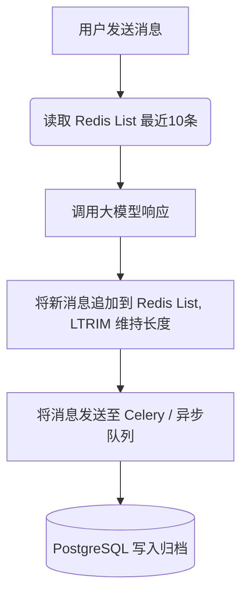

# Industrial-Grade Agent Memory Design (工业级智能体记忆系统设计提案)

在当前系统的实现中，对话记忆采用了最基础的“每次查询完整历史，在内存切片最后 10 条，并同步写入 PostgreSQL 磁盘”的方式。你的直觉非常敏锐，**在实际生产环境中，这种设计存在严重的性能瓶颈与体验缺陷**。

本文档将详细解剖当前实现的不足，介绍业界大厂（如 OpenAI Assistants, LangChain, 顶级企业级 Chatbot）在处理记忆系统时的工业级架构，并为你提供可落地、分阶段的改进设计方案（包括 Redis 缓存与 LLM 历史摘要的混合架构）。

---

## 1. 现有记忆实现的痛点与缺陷

当前系统的记忆模型位于 `runner.py` 与 `message.py` 中，主要面临以下三大致命问题：

### 痛点一：低效的数据库 $O(N)$ 读取与高频磁盘 I/O
在 [message.py](file:///D:/Projects/code/python/communitys-agent-banked-py/app/database/service/message.py) 的 `get_messages` 中：
```python
messages = (
    db.query(MessageModel)
    .filter(MessageModel.session_id == session_id)
    .order_by(MessageModel.created_at.asc())
    .all()  # 读取了当前会话的所有历史消息！
)
return DbResult(data=[...])
```
* **问题**：哪怕一个会话已经聊了 1000 轮，该查询也会将 1000 条数据**全部从磁盘读取到 Python 内存中**，然后在 `runner.py` 里进行 `[-10:]` 的切片。
* **后果**：随着聊天轮数增加，响应延迟呈**线性级指数级恶化**，磁盘 I/O 频繁且浪费，极易在数据库侧造成 CPU 飙升。
* **修复（即时改善）**：若不加缓存，底层的 SQL 查询也必须改为 `limit 10` 并按时间倒序拉取。

### 痛点二：短期滑动窗口的“健忘症”
* **问题**：目前记忆只保留最后 10 条（5 轮对话）。
* **后果**：只要对话超过 5 轮，用户在第 1 轮中说过的关键信息（例如：“我是 3 栋 1202 的业主，我叫张三”）就会被无情擦除，Agent 会瞬间变得“健忘”，严重伤害用户体验。

### 痛点三：Token 浪费与冗余度高
* **问题**：直接将原始的历史对话文字拼接在 Prompt 头部。
* **后果**：聊天记录中包含大量诸如“你好”、“谢谢”、“没问题”等无效口水词，直接浪费了珍贵的 Context Window 空间，并在长期累积中增加了大模型的运行成本。

---

## 2. 业界大厂是如何处理 Agent 记忆的？

在现代工业级 AI Agent 架构中，记忆通常被视作智能体的“认知基础”，被划分为**分层记忆架构（Hierarchical Memory Architecture）**：

```
                              +-------------------------------------------------+
                              |              大模型大脑 (LLM Core)               |
                              +-------------------------------------------------+
                                      |                    |                    |
          +---------------------------+                    |                    +---------------------------+
          |                                                |                                                |
          v                                                v                                                v
+-------------------+                            +-------------------+                            +-------------------+
| 1. 感官记忆 (Sensory) |                            | 2. 工作记忆 (Working) |                            | 3. 长期记忆 (Long-Term) |
|   Redis 缓存 / List |                            |  历史对话滚动摘要   |                            |  用户画像 + 向量库 RAG |
|   (最近 5 轮 raw)   |                            |   (LLM Summarize) |                            |  (Preferences / Vector) |
+-------------------+                            +-------------------+                            +-------------------+
|  速度：微秒级 (O(1)) |                            |  速度：秒级 (异步)  |                            |  速度：毫秒级 (ANN) |
|  作用：保留近期语境 |                            |  作用：压缩历史主干 |                            |  作用：记住万年事实 |
+-------------------+                            +-------------------+                            +-------------------+
```

### 1) 感官记忆（Sensory Memory / 极速缓存层）
* **存储介质**：内存数据库（如 **Redis**）。
* **机制**：以 `session_id` 作为 Key，使用 Redis 的 `List` 结构来存放最近的原始对话 JSON，设置过期时间（如 1 天）。利用 `LTRIM` 始终保持列表在固定长度（如 10 条）。
* **优点**：读写均在内存进行（微秒级），完全消除了实时磁盘数据库（PostgreSQL）的读压力。

### 2) 短期/工作记忆（Short-Term Memory / 故事线摘要）
* **机制**：**Conversation Summary Memory（对话摘要记忆）**。
* **方案**：系统设定一个滑动窗口阈值（例如 10 条）。当 Redis 中的原始对话累积超过 10 条时，**启动一个后台异步任务**，调用一个成本极低、速度极快的小模型（如 Claude Haiku 或 DeepSeek-Flash），将最老的那 2 条对话内容与先前的“历史摘要”合并，重新生成一段新的、高内聚的“会话大纲摘要”，然后覆盖数据库中的摘要字段。
* **效果**：对话大纲仅需几十个 Token，却保存了之前 100 轮对话的全部核心事实（“用户姓名”、“房号”、“已查询过天气并讨论了电费问题”）。

### 3) 长期记忆 / 语义记忆（Long-Term Memory）
* **机制**：**User Profile（用户偏好画像）** + **Episodic Memory（偶发事件向量记忆）**。
* **事实性画像**：后台定时任务（或触发式工具）在检测到关键事实时（如“用户提到自己养了只猫叫 Max”），会将此偏好存入数据库的 `user_preferences` 表。在每次新会话开始时，直接作为 System Prompt 的一部分喂给 LLM。
* **偶发事件检索**：如果用户提问“上次我家里水管漏水是找哪个师傅修的？”，这属于久远的历史偶发事件。系统会通过向量数据库（如 pgvector / Pinecone），对用户的历史长对话记录做向量检索，命中一年前的某次维修对话片段，然后注入到 Prompt 中。

---

## 3. 工业级改进方案设计蓝图

结合你的项目现状，我们设计了一套**高内聚、易落地**的“Redis 缓存 + LLM 历史摘要”改造方案。

### 阶段一：引入 Redis 缓存层，彻底消灭高频磁盘 I/O

我们将原本同步读写数据库的逻辑，改造为**“读写缓存优先，延迟批量同步”**。



#### Redis 队列操作伪代码：
```python
import redis
import json

r = redis.Redis(host='localhost', port=6379, db=0)

def push_message_to_cache(session_id: int, role: str, content: str):
    key = f"session:{session_id}:messages"
    msg_data = json.dumps({"role": role, "content": content, "timestamp": time.time()})
    
    # 管道操作保证原子性
    pipe = r.pipeline()
    pipe.rpush(key, msg_data)
    pipe.ltrim(key, -10, -1)  # 永远只保留 Redis 中最近的 10 条 raw 消息
    pipe.execute()

def get_recent_messages_from_cache(session_id: int) -> list:
    key = f"session:{session_id}:messages"
    raw_list = r.lrange(key, 0, -1)
    return [json.loads(x) for x in raw_list]
```
> [!TIP]
> **延迟写入（Write-Behind）**：前端等待响应时，数据仅在极速的 Redis 读写。随后通过 `asyncio.create_task` 或后台任务队列，将消息打包慢吞吞地批量同步进 PostgreSQL 作为冷备份，以此实现 PostgreSQL “零实时读写压力”。

---

### 阶段二：LLM 历史摘要（Summary）设计实现

当会话在 Redis 中发生滚动时（即超出 10 条，有消息被 `ltrim` 挤出时），后台启动轻量级 LLM 任务进行“记忆整合”。

#### 1) 数据库结构改造
在 `Session` 数据表中引入 `history_summary` 字段，存储当前会话之前的累计摘要。

#### 2) 历史摘要更新 Prompt 设计
```python
SUMMARY_PROMPT = """
你是一个对话记忆整理助手。请把【新增对话记录】合并到现有的【旧历史大纲】中，生成一份更新后的、信息高度凝练的【新历史大纲】。

【旧历史大纲】：
{old_summary}

【新增对话记录】：
用户: {user_msg}
助手: {assistant_msg}

请遵循以下规则生成：
1. 保持客观、精炼，仅保留关键事实（如用户姓名、地址、核心诉求、已解决或待办事件）。
2. 去除所有寒暄、口水话和修辞。
3. 如果没有新增的核心事实，请完整保留【旧历史大纲】并直接返回。
4. 控制在 150 字以内。

更新后的【新历史大纲】：
"""
```

#### 3) Agent 运行时 Prompt 组装逻辑
每次 Agent 触发时，组装给 Claude 的输入将包含 `[系统设定]` + `[历史大纲（冷记忆）]` + `[Redis 中的 10 条原始对话（热记忆）]`：

```python
async def handle_message(self, session_id: int, user_input: str):
    # 1. 读 Redis 极速获取最近 10 条原始消息
    recent_messages = get_recent_messages_from_cache(session_id)
    
    # 2. 读 DB 获取该 Session 的冷记忆历史大纲 (单行查询, O(1))
    history_summary = get_session_summary_from_db(session_id)
    
    # 3. 组装输入
    system_prompt = "你是一个贴心的社区智能管家。\n"
    if history_summary:
        system_prompt += f"【此前对话的核心背景大纲】：\n{history_summary}\n"
        
    # 4. 组装历史 raw 消息
    history_ctx = ""
    for msg in recent_messages:
        role_name = "用户" if msg["role"] == "user" else "助手"
        history_ctx += f"{role_name}: {msg['content']}\n"
        
    full_prompt = f"{history_ctx}用户: {user_input}"
    
    # 5. 提交给大模型...
```

---

## 4. 落地建议与演进路线

你的改进方案非常靠谱，推荐按以下节奏进行架构重构：

* **第一步 (开销最小，见效最快)**：修改 [message.py](file:///D:/Projects/code/python/communitys-agent-banked-py/app/database/service/message.py) 的 SQL 查询，使用 `LIMIT 10` 从数据库倒序拉取。先解决随着聊天增长导致读出几百条记录并在内存切片的愚蠢行为。
* **第二步 (解决 I/O 压力)**：引入 **Redis 缓存层**。将近期的 10 条聊天记录全权交由 Redis 读写，PostgreSQL 退化为异步冷备份存储，彻底消除高频磁盘 I/O。
* **第三步 (解决健忘症与 Token 消耗)**：引入 **LLM 异步历史摘要**，只在 Redis 发生溢出裁剪时触发，生成“冷记忆大纲”注入系统提示词。这不仅根治了 Agent 聊天超过 5 轮就“失忆”的问题，还大幅缩减了高轮次下的 Token 话费。
